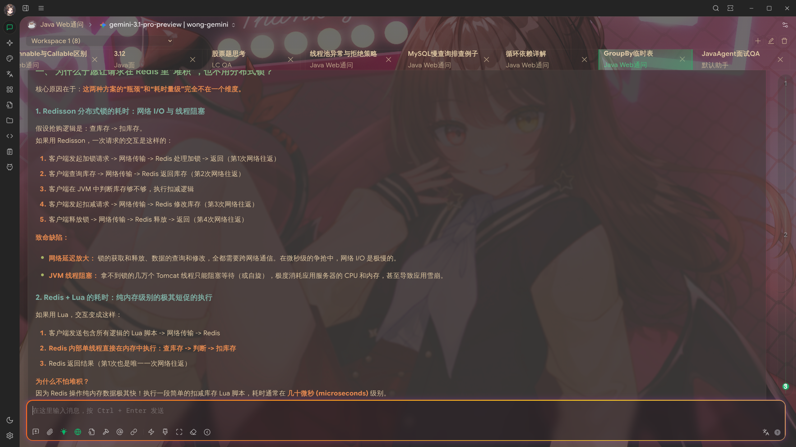

# Cherry Studio 补丁更新说明

[中文](README.md) | [English](docs/en/README.md)

本 README 仅保留本次补丁系列新增的功能。

## 界面预览



## 核心功能更新

1. 透明且持久化的多标签 UI
- 多标签栏为完全透明样式（非毛玻璃卡片）。
- 支持鼠标中键关闭标签。
- 重启应用后恢复已打开标签与当前活动标签。
- 记忆标签栏横向滚动位置。

2. 基于工作区的标签分组
- 多标签可按工作区分组管理。
- 支持创建、切换、重命名、删除工作区。
- 每个工作区维护独立的标签集合和活动会话。
- 工作区状态在重启后可恢复。

3. 全新时间线 UI 与稳定性修复
- 修复滚动后时间线消失问题。
- 修复首尾节点显示被裁切问题。
- 活动节点与导航/视口位置对齐。
- 节点悬停显示精简预览（用户输入 + 模型输出）。

4. 会话位置持久化
- 按时间线节点序号保存会话位置。
- 重启应用后可回到该会话上次节点位置。

5. 时间线快捷键
- `Alt+ArrowUp`：跳转到上一节点。
- `Alt+ArrowDown`：跳转到下一节点。
- `Alt+Shift+ArrowUp`：跳转到首节点。
- `Alt+Shift+ArrowDown`：跳转到末节点。

6. 模型分组与路由模式
- 助手可选择使用单模型，或使用模型分组。
- 模型分组为全局共享能力，可在不同助手之间复用。
- 模型分组由用户自由定义，不限制“同模型/同提供商”组合。
- 支持两种路由模式：
  - `order-first`：按分组顺序尝试，前一个不可访问时自动回退到下一个。
  - `round-robin`：请求按模型顺序轮询分发（1->2->3->1...）。
- 可在助手设置和聊天顶部模型切换器中切换“单模型 / 分组”。

7. 生成中继续发送
- 在模型仍在输出时可继续发送下一条消息。

8. Arch Linux PKGBUILD 支持
- 新增 Arch Linux 安装打包文件：
  - `pkgbuilds/arch/cherry-studio-bin/PKGBUILD`
  - `pkgbuilds/arch/cherry-studio-bin/.SRCINFO`
  - `pkgbuilds/arch/README.md`
- 支持 `x86_64` 与 `aarch64`。

9. 启动器导航（键盘 + 鼠标）
- 新增第三个标签页：`打开启动器`。
- 新增启动器快捷键：`Ctrl+P` / `Cmd+P`。
- 启动器支持助手/话题搜索与键盘导航（`↑`、`↓`、`Enter`、`Esc`）。

10. 多入口右键菜单能力对齐
- 会话多标签中的助手/话题支持右键，并复用左侧栏同一套菜单能力。
- 启动器标签页与启动器弹窗中的助手/话题支持右键，并复用左侧栏同一套菜单能力。
- 助手与话题的编辑/管理操作在各入口保持一致。

11. 启动器内直接创建助手/话题
- 在启动器中新增快捷创建入口：
  - `+ 助手`
  - `+ 话题`（在当前激活助手下创建）
- 创建后会立即选中并跳转到新对象。

12. 模型分组显示提供商来源
- 模型分组成员现在显示为 `模型名 | 提供商`。
- 当分组中存在同名模型时，更容易定位哪个来源不可用或失效。

13. Markdown 导出支持图片资源
- 话题 Markdown 导出现在可保留“仅图片输入”的消息。
- 导出规则：
  - 纯文本话题：仅导出 `.md`。
  - 包含上传图片文件的话题：导出 `.md` + 同级 `<markdown-name>.assets/` 目录，并在 Markdown 中引用复制后的图片文件。
  - URL 图片会保留为 Markdown 外链。

14. GPT-5.2+ 推理强度支持
- 对于 GPT-5.2 及更新的非 chat、非 pro OpenAI 推理模型，现在会正确显示推理强度选项，并在支持时提供 `xhigh`。
- 这样可以让 Cherry Studio 与新版 GPT-5 推理模型可用的更高思考预算保持一致。

15. 启动器支持切换下一张背景图
- 当启用背景幻灯片后，`Ctrl+P` / `Cmd+P` 启动器中会新增 `下一张背景图片` 操作。
- 该操作可搜索，支持启动器弹窗/标签页模式，使用界面翻译，并会在切换成功后自动关闭弹窗。

16. Token 统计面板
- 新增独立的 `设置 -> 统计` 页面。
- 按助手 / 话题 / 对话三级聚合 Token 使用量。
- 展示输入 Token、输出 Token、总 Token、消息数量与更新时间。

17. 聊天顶部模型分组管理更便捷
- 顶部模型切换器新增 `编辑模型组` 入口。
- 点击后可直接打开助手设置中的模型配置页。
- 顶部模型分组名称与数量展示已完成本地化。

18. 聊天背景轮播
- 为聊天内容区域新增可配置的背景轮播能力。
- 设置入口位于 `设置 -> 显示 -> 背景轮播`。
- 支持多图片目录、切换间隔、透明度与手动 `下一张`。
- 软链接图片文件与软链接子目录会按普通文件/目录同样处理，因此可直接使用整理好的软链接图片目录作为轮播源。
- 新增快捷键 `Ctrl/Cmd+Shift+U`，可在文件夹中显示当前背景图。

19. Anthropic 提供商 Claude Code 兼容模式
- 新增提供商级别的 `Claude Code 兼容模式` 开关。
- 开启后，请求会使用 Claude Code 兼容的请求头与 User-Agent 行为。
- 自定义请求头弹窗支持一键应用 Claude Code 兼容请求头。

20. 启动器助手点击行为修复
- 在启动器弹窗（`Ctrl/Cmd+P`）中点击助手时，会创建新话题并停留在该新话题标签页。
- 修复了“先跳到新话题又回弹到之前标签页”的异常行为。

21. 用户纯文本消息链接识别
- 在关闭“输入消息按 Markdown 渲染”时，用户消息中的纯文本 URL 现在会自动渲染为可点击链接。
- 增加了安全外链打开逻辑及对应测试。

22. 会话多标签切换状态稳定性
- 使用 `Ctrl+Tab` / `Ctrl+Shift+Tab` 切换会话标签时，可稳定保留各标签各自的阅读滚动位置。
- 返回上一个标签时，不再出现由代码块延迟重排导致的“先错位再跳回”现象。
- 时间线/导航状态按会话标签容器隔离绑定，避免跨标签状态互相覆盖。

23. 会话切换与历史渲染体验优化
- 会话标签面板改为持续挂载，回到已打开标签时可更快恢复并更稳定保留各标签状态。
- 切换到尚在加载内容的会话时，新增短时骨架屏与过渡遮罩，减少突兀白屏感。
- `Ctrl+Tab` / `Ctrl+Shift+Tab` 增加按键锁存逻辑，避免长按时误触多次连续跳转。
- 会话历史流图重构为强类型数据处理，并配合记忆化 selector，降低不必要重渲染开销。

24. 大话题滚动性能与稳定性加固
- 优化时间线锚点定位逻辑，避免长会话中滚动时反复进行高开销 DOM 扫描。
- 降低消息区与时间线 UI 的合成器压力，移除高成本特效与强制 GPU 分层提示。
- 为超大话题增加时间线锚点自适应渲染数量限制。
- 为消息项增加 `content-visibility` 优化，减少离屏渲染负担。
- 当消息数量非常大时自动关闭时间线锚线，避免渲染器过载。

25. 会话标签关闭快捷键
- 在聊天会话多标签栏中，`Ctrl/Cmd+W` 现在会关闭当前激活的会话标签。
- 当只剩最后一个会话标签时不会执行关闭，避免误关当前窗口或会话视图。

26. 聊天消息视口布局修复
- 修复了一个布局回归：会话顶部区域可见，但消息视口会塌陷为零高度，导致聊天正文消失。
- 共享消息滚动容器现在会明确拉伸填满可用聊天区域，避免消息正文不显示。

27. 第一阶段渲染性能基础优化
- 新增仅开发环境启用的渲染性能监控，可记录时序、长任务和堆内存快照。
- 会话面板现在支持 `active` / `warm` / `cold` 生命周期控制，只会在可用内存低于 10% 时冷却非活跃标签，并在恢复到 15% 以上后再重新升温。
- 处于 warm 状态的非活跃标签会暂停时间线锚点与 Token 估算工作，同时复用共享的消息/时间线派生结果，减少活跃路径上的重复计算。
- 新增 `Alt+Numpad1..9` 直接跳转时间线节点。

28. 聊天路由保活与渲染稳定性加固
- 进入设置页等非首页路由时，首页聊天路由现在会继续保活，返回后可保留流式输出状态、滚动位置和本地会话 UI 状态。
- 应用启动时会先恢复持久化的激活标签，再执行路由同步副作用，同时标签状态现已保留在持久化 Redux 存储中。
- 大型流式 Markdown 内容会更积极地延后高开销渲染，多处消息/区块 selector 也做了稳定化处理，以减少聊天区、时间线、大纲和菜单栏上的重复重渲染。
- 重新打开会话时会自动纠正被中断流式输出遗留的陈旧区块状态，时间线锚点也会标记失败的助手回复，同时不会覆盖已保存的滚动恢复。

## Arch Linux 快速安装

```bash
cd pkgbuilds/arch/cherry-studio-bin
makepkg -si
```
